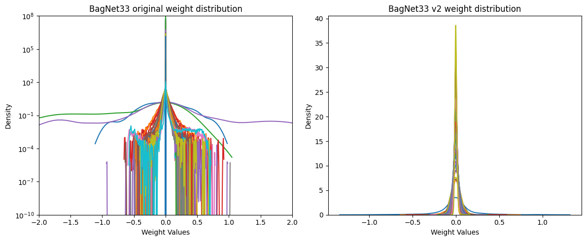

# BagNets v2

This repository contains an updated version of the pytorch implementation of the bag-of-local-feature models (BagNets) originally introduced by Wieland Brendel and Matthias Bethge at ICLR 2019.

* BagNet paper: [Approximating CNNs with Bag-of-local-Features models works surprisingly well on ImageNet](https://openreview.net/pdf?id=SkfMWhAqYQ).
* BagNet original repository: [BagNets](https://github.com/wielandbrendel/bag-of-local-features-models). 

### Why update BagNets?
The main reason to update the pytorch implementation of bagnets is the presence of dead layers with near 0 weights in the models pretrained with ImageNet, which causes significant differences at inference time when using TF32 vs FP32. This numerical instability is explored in the [bagnet_tf32vsfp32.ipynb](bagnet_tf32vsfp32.ipynb) notebook.

Other updates are mostly related to newer releases of pytorch, such as:
* Weight initialization: Kaiming initialization is now implemented in pytorch.
* Average pooling: to use the adaptive version.
* Added padding: to avoid downsampling by indexing and reduce the presence of artifacts in heatmaps of images that contain the equivalent to 0 padding such as the black area around fundus images.
* Removed conv1: since 2 convolutional layers without a non-linearity in between are equivalent to a single convolutional layer, because they are linear operations. This additional layer is present in the original pytorch implementation, however it is not present in the paper's architecture diagram.
* Batch normalization momentum: found no difference when changing the momentum of bn1 to match the default of the other layers.

### Installation
```bash
conda env create -f environment.yml
```

### Usage
To load any of the bagnetsv2 pretrained on ImageNet, use the name "bagnet33", "bagnet17" or "bagnet9". To load a model with randomly initialized weights change weights to None.

```python 
import bagnetsv2 as bagnets
model = bagnets.get_bagnet(name='bagnet33', weights='DEFAULT', num_classes=1000)
```

The models expect RGB images as tensors with normalized pixel values. The augmentations can be retrieved by the "get_augmentations" function from utils.py. 

```python 
import utils
utils.get_augmentations(img_size, normalization=utils.ImageNet_NORMALIZATION)
```

To pretrain a bagnet on imagenet change IMAGENET_DIR in utils.py and use:
```bash
torchrun --standalone --nproc_per_node=8 pretrain_imagenet_multigpu.py --backbone bagnet33 --dataset imagenet --batchsize 1024 --epochs 90 --numworkers 4
```

For small scale experiments the dataset argument can be changed to use imagenette.

### Pretrained weights
The model weights released in this repository were pretrained on ImageNet with 8 A100 GPUs for 90 epochs (14h10). :
* Dataset: the training set of ImageNet was partitioned into train and validation (95-5%). The validation set was used as the hold out test set.
* Effective batch size: 1024.
* Optimizer: SGD with learning_rate=0.01*batch_size/256, momentum=0.9, weight_decay=1e-4. 
* Scheduler: LR Scheduler with step_size=30 and gamma=0.1.
* Early stopping: based on validation loss with patience=10 and min_delta=1e-4.

The following table shows performance of these weights on the hold out set:
|  **Model**  	| **Top 1 acc** 	| **Top 5 acc** 	|
|:-----------:	|:-------------:	|:-------------:	|
| Bagnet33 v2 	|         65.48 	|         86.34 	|
| Bagnet17 v2 	|         58.26 	|         80.79 	|
| Bagnet9 v2  	|         46.14 	|         70.40 	|

### Numerical instability and dead layers
The weights from the original bagnets contain dead layers that lead to a drop in performance when operations are performed in TF32 or mixed precision compared to FP32. Setting the weights of the dead layers to 0 does not change the output of the neural network, which means they don't contribute in any significant way to the prediction. However, when using different floating point representations to perform operations with these weights, noise gets propagated through the network and results in different output values depending on the precision format.

Retraining the bagnets without dead layers is particularly relevant when GPUs that support TF32 and mixed precision are used. Since newer releases of pytorch enable the use of TF32 tensor cores by default when they are available, which is the case for Ampere and later architectures commonly used to train deep learning models.

The following table shows the performance drop when the original bagnet33 is evaluated on the validation set of ImageNet vs bagnet33 v2 (available in the models folder of this repo).

|  **Model**  	|  **Precision**  	| **Top 1 acc** 	| **Top 5 acc** 	|
|:-----------:	|:---------------:	|:-------------:	|:-------------:	|
| BagNet33    	| mixed (float16) 	| 57.96         	| 80.34         	|
|             	| tf32            	| 64.23         	| 85.31         	|
|             	| float32         	| 66.70         	| 87.00         	|
| BagNet33 v2 	| mixed (float16) 	| 65.48         	| 86.34         	|
|             	| tf32            	| 65.49         	| 86.35         	|
|             	| float32         	| 65.51         	| 86.35         	|

The difference can also be observed by looking at the distribution of the weights from the convolutional layers from bagnet33 and bagnet33 v2 pretrained on ImageNet. Note the y axis of the plot for the original bagnet has a logarithmic scale.



More details can be found in the [bagnet_tf32vsfp32.ipynb](bagnet_tf32vsfp32.ipynb) notebook.

